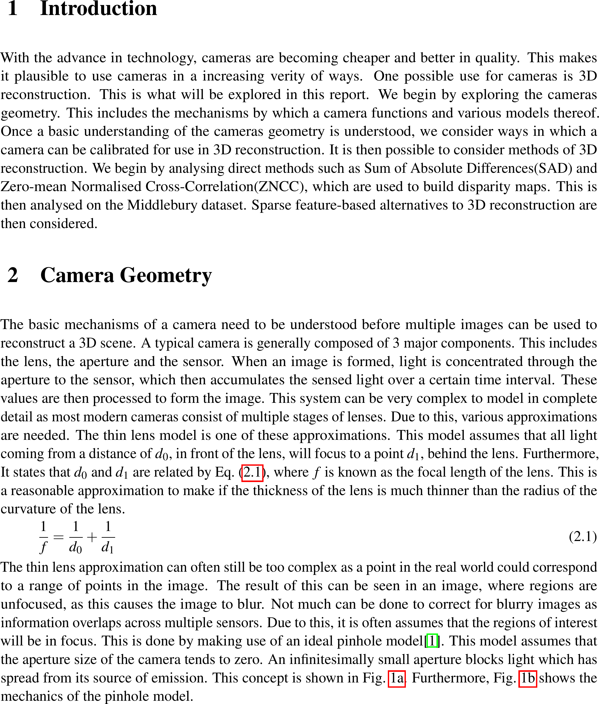
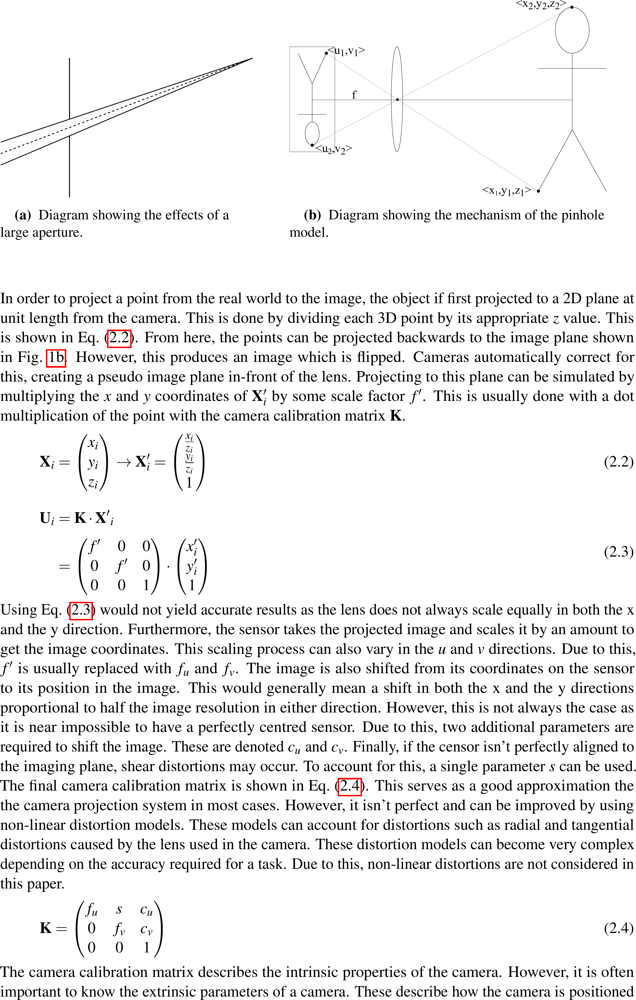
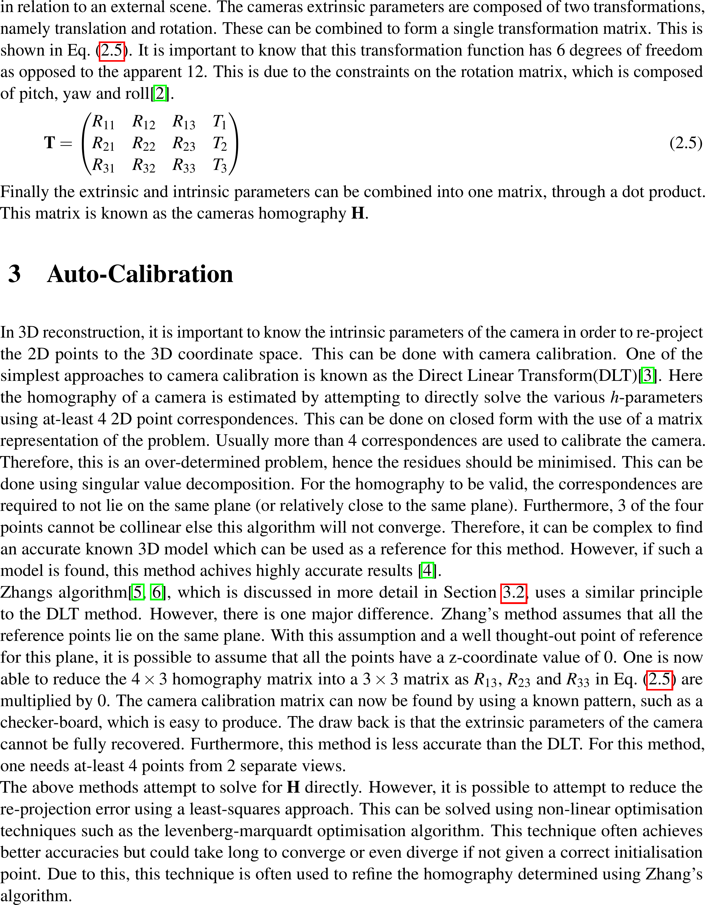
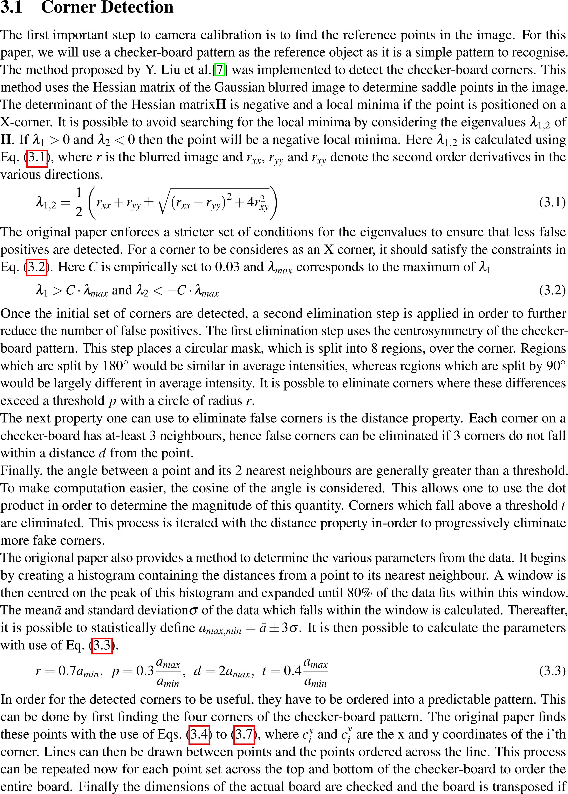
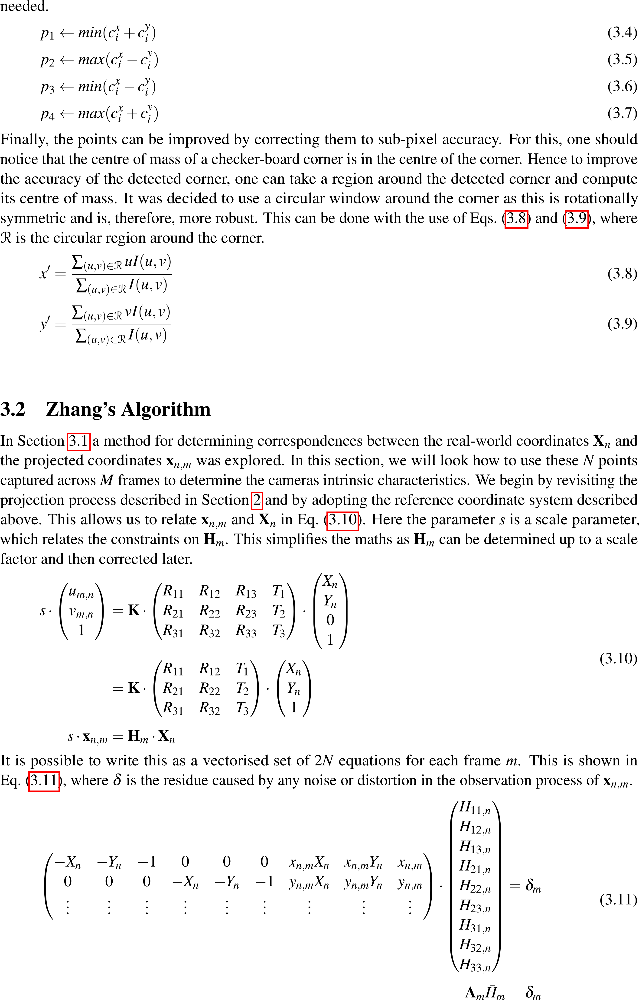
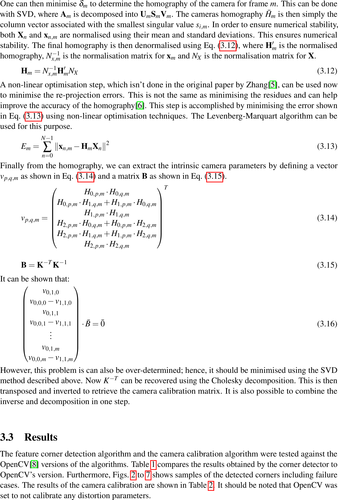
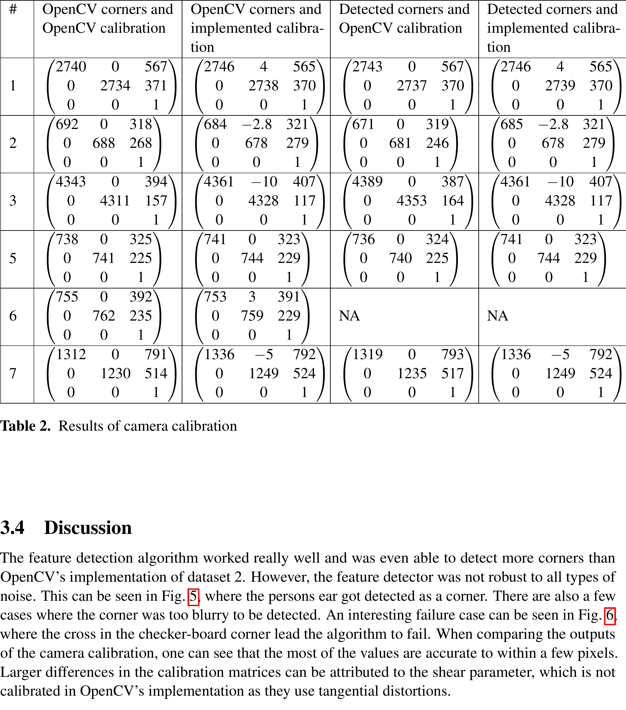

# Camera Calibration

> Python implementaion of Zhang's algorithm from first principles.

This repository implements Zhang's algorithm to calculate the intrinsic camera parameters. A checkerboard is used as the ground-truth pattern for camera calibration. To detect and order the checkerboard corners, the corner detector proposed by Y. Liu is used. The resulting algorithm is compared to OpenCV's implementation.

---

## Table of Contents (Optional)

- [Installation](#installation)
- [Usage](#usage)
- [Documentation](#documentation)
- [Disclamer](#disclamer)

---

## Installation

- Install python
- Install various depencancies such as numpy ( requirements.txt to come )
- Run the code

## Usage

- Coming soon

## Documentation

---

## Disclamer

This repository is for educational purposes only. The algorithms implemented here is my interpretation of the original authors' work. Due to this, they will most likely not produce the same results as the original implementations. All rights are reserved to the original authors of the papers this code was based on. 
